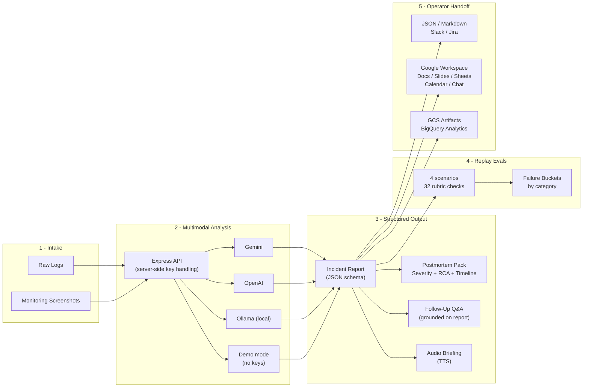

# AegisOps -- Multimodal Incident Architecture System

[](https://github.com/KIM3310/AegisOps/actions)
[](https://www.typescriptlang.org/)
[](https://react.dev/)
[](./LICENSE)

**AegisOps** turns raw incident logs and monitoring screenshots into structured, decision-ready incident reports -- complete with severity classification, root-cause analysis, timeline reconstruction, and operator handoff artifacts. Every analysis claim is backed by a deterministic replay eval suite before the live model path is trusted.

## Three-Minute Proof

1. Open the Cloudflare demo or local UI and run one incident scenario.
2. Inspect the replay eval suite before trusting live model output.
3. Run `npm run verify` to cover typecheck, tests, replay evals, architecture smoke, and build.
4. Architecture export/handoff artifacts as the architecture-facing proof, not just the chat flow.

## Product and System Surface

| Lens | Current answer |
|---|---|
| Audience | SOC, IT operations, managed service, and incident-response teams that need clearer handoff after noisy incidents. |
| Architecture path | Validate the demo, README, architecture notes, and quality gate before deeper workflow architecture. |
| System signal | Multimodal incident analysis, schema-conformant reports, replay evals, follow-up Q&A, and export paths. |
| Safety boundary | Browser never receives provider keys; demo mode is deterministic and no-key by default. |
| Fast path | `npm run verify`, live Cloudflare Pages demo, replay eval suite, and architecture smoke script. |

## System Fast Path

- **First minute:** Open the Cloudflare demo, run one incident scenario, then inspect replay eval coverage.
- **Local demo:** Run `npm install && npm run dev`; the UI runs on `http://127.0.0.1:3000` and API on `http://127.0.0.1:8787`.
- **Verification:** Run `npm run verify`; it covers typecheck, tests, replay evals, architecture smoke, and build.

## Service Launch Playbook

- [Service launch playbook](docs/service-launch-playbook.md) maps the repository to architecture audiences, operating gates, operating boundaries, and risk controls.

## Architecture Notes

- [Architecture guide](docs/architecture-evidence-map.md) summarizes the project angle, first files to inspect, runtime commands, and known boundaries.
- [Quality notes](docs/quality-gate.md) lists the local checks, CI surface, and release expectations for this repository.
- [Enterprise readiness notes](docs/enterprise-readiness.md) outlines security, data, operations, integration, and handoff expectations.

## Live Demo

| Surface | Link |
|---|---|
| Cloudflare Pages | https://aegisops-ai-incident-doctor.pages.dev |
| Google AI Studio | [Open in AI Studio](https://ai.studio/apps/drive/1nInCvCJjSXy0IQGiDeK9gbsjjhhPqtlg?fullscreenApplet=true) |
| Demo video | [Watch on YouTube](https://youtu.be/FOcjPcMheIg) |

---

## Architecture



**Key design principle:** API keys never reach the browser. The React frontend calls `/api/analyze`, `/api/followup`, `/api/tts` -- the Express API reads provider keys server-side and returns validated, schema-conformant JSON.

---

## Quick Start

### Prerequisites

- **Node.js >= 20** and npm
- (Optional) A Gemini or OpenAI API key for live analysis
- (Optional) [Ollama](https://ollama.com) for fully offline local analysis

### Run locally

```bash
# 1. Clone and install
git clone https://github.com/KIM3310/AegisOps.git
cd AegisOps
npm install

# 2. Configure (optional -- runs in demo mode without keys)
cp .env.example .env
# Edit .env to add GEMINI_API_KEY or OPENAI_API_KEY

# 3. Start both API and UI
npm run dev
# UI:  http://127.0.0.1:3000
# API: http://127.0.0.1:8787
```

If no API key is set, the system runs in **demo mode** -- deterministic output, no external calls, and the full replay eval suite still runs.

### Verify the build

```bash
npm run verify   # typecheck + test + replay evals + architecture smoke + build
```

---

## Tech Stack

| Layer | Technology | Purpose |
|---|---|---|
| Frontend | React 19, Vite 6, Lucide Icons | Incident input, report rendering, operator dashboard |
| Backend | Express, Node.js 20+ | API routing, key management, payload validation |
| LLM Providers | Gemini (default), OpenAI, Ollama | Multimodal incident analysis + follow-up Q&A |
| Validation | Zod 4 | Request/response schema enforcement |
| Logging | Pino | Structured JSON logging |
| Eval Framework | Custom replay harness | 4 scenarios, 32 rubric checks, failure bucket aggregation |
| Auth | Bearer token + OIDC (RS256 JWT) | Operator access control with role-based gating |
| Persistence | GCS + BigQuery (optional) | Report artifacts + analytics rows |
| Monitoring | Prometheus + Datadog (optional) | HTTP metrics, analysis latency, provider usage |
| Cloud Infra | Terraform (Cloud Run), Cloudflare Pages | IaC deployment, static hosting |
| Containers | Docker, Kubernetes (HPA, Ingress) | Production container orchestration |
| CI/CD | GitHub Actions | Typecheck, test, replay proof, build, artifact upload |
| Language | TypeScript 5.8 (strict mode) | End-to-end type safety |

---

## Core API

| Endpoint | Method | Description |
|---|---|---|
| `/api/analyze` | POST | Analyze logs + screenshots, return structured incident report |
| `/api/followup` | POST | Follow-up Q&A grounded on the generated report |
| `/api/tts` | POST | Text-to-speech audio briefing (Gemini TTS) |
| `/api/evals/replays` | GET | Replay eval suite results (4 scenarios / 32 checks) |
| `/api/live-sessions` | GET | Persisted incident session history |
| `/api/meta` | GET | Runtime modes, replay summary, operator checklist |
| `/api/healthz` | GET | Deployment mode, provider, limits |
| `/api/summary-pack` | GET | Inspectable trust surface with replay proof |
| `/api/schema/report` | GET | Incident report JSON schema contract |
| `/api/metrics` | GET | Prometheus-format metrics |

---

## Incident Replay Evals

The replay eval suite validates report quality against fixed scenarios with a structured rubric before the live model path is trusted.

```bash
npm run eval:replays
```

**Suite:** `evals/incidentReplays.ts` | **Scoring:** `server/lib/replayEvals.ts`

### Rubric categories

| Category | What it checks |
|---|---|
| `severity_match` | Severity classification matches the expected level |
| `title_keywords` | Title captures the dominant failure mode |
| `tag_coverage` | Operational tags cover the main systems involved |
| `timeline_coverage` | Timeline retains enough events for reconstruction |
| `root_cause_coverage` | Root causes name the failure mode, not just symptoms |
| `actionability` | Action items are concrete and operator-facing |
| `reasoning_trace` | Reasoning preserves Observations, Hypotheses, Decision Path |
| `confidence_range` | Confidence score stays within the rubric band |

### Current scenarios

| Scenario | Description |
|---|---|
| `llm-latency-spike` | SLO breach, queue saturation, memory pressure, autoscaling recovery |
| `redis-oom-failover` | Redis master OOM, quorum loss, cache miss storm during failover |
| `payments-retry-storm` | 5xx spike + retry fan-out and request queue growth |
| `search-warning-buildup` | Pre-outage warning with latency and queue buildup (no hard outage) |

See `docs/INCIDENT_REPLAY_EVALS.md` for full documentation.

---

## Deployment

### Local development

```bash
npm install && npm run dev
```

### Cloudflare Pages

```bash
npm run build && wrangler pages deploy dist/
```

### Docker / Cloud Run

```bash
docker build -t aegisops .
docker run -e GEMINI_API_KEY=<key> -e HOST=0.0.0.0 -p 8787:8787 aegisops
```

### Terraform (GCP Cloud Run)

```bash
cd infra/terraform
terraform init
terraform plan -var="project_id=<your-project>" -var="image=<your-image>"
terraform apply
```

### Kubernetes

Pre-built manifests in `infra/k8s/` include Deployment, Service, HPA, Ingress, and ConfigMap.

### Optional GCP persistence

Set `GOOGLE_APPLICATION_CREDENTIALS` + `GCP_PROJECT_ID` to persist incident artifacts to GCS and analytics rows to BigQuery.

---

## Project Structure

```
AegisOps/
  App.tsx                    # React app root
  types.ts                   # Shared TypeScript types
  constants.ts               # Sample presets, architecture lenses
  components/                # React UI components (26 files)
  hooks/                     # React hooks (app state, auth, storage)
  services/                  # Frontend service clients (Google APIs, Gemini, export)
  server/
    index.ts                 # Express API server (~700 lines, 15+ routes)
    lib/
      gemini.ts              # Gemini provider (analyze, follow-up, TTS)
      openai.ts              # OpenAI provider (analyze, follow-up)
      ollama.ts              # Ollama provider (analyze, follow-up)
      demo.ts                # Deterministic demo mode
      replayEvals.ts         # Replay eval scoring and bucket aggregation
      schemas.ts             # Zod request validation schemas
      operatorAccess.ts      # Bearer + OIDC operator auth
      gcp-persistence.ts     # GCS artifact upload, BigQuery analytics
      prometheus.ts          # Prometheus metrics
      datadog-adapter.ts     # Datadog integration
      aws-adapter.ts         # AWS S3/SQS/CloudWatch integration
      ...
  evals/
    incidentReplays.ts       # 4 replay scenarios with expected rubrics
  __tests__/                 # 29 test files (Vitest)
  scripts/                   # CLI tools (replay runner, smoke tests, load tests)
  infra/
    terraform/               # GCP Cloud Run IaC
    k8s/                     # Kubernetes manifests
  docs/                      # Architecture docs, evidence, SVGs
  samples/                   # Sample logs, screenshots, resource packs
  .github/workflows/         # CI pipeline (test, build, artifact upload)
```

---

## Testing

```bash
npm test                    # Unit tests (Vitest, 29 test files)
npm run typecheck           # TypeScript strict mode check
npm run eval:replays        # Replay eval suite (4 scenarios / 32 checks)
npm run architecture:smoke        # Architecture surface smoke tests
npm run verify              # All of the above + build
```

---

## Environment Variables

See `.env.example` for the full list. Key variables:

| Variable | Required | Description |
|---|---|---|
| `LLM_PROVIDER` | No | `auto` (default), `gemini`, `openai`, `ollama`, `demo` |
| `GEMINI_API_KEY` | For live mode | Google Gemini API key |
| `OPENAI_API_KEY` | For OpenAI mode | OpenAI API key |
| `OLLAMA_BASE_URL` | For local mode | Ollama server URL (default: `http://127.0.0.1:11434`) |
| `GCP_PROJECT_ID` | For persistence | GCP project for GCS + BigQuery |
| `AEGISOPS_OPERATOR_TOKEN` | For auth | Static operator bearer token |
| `DD_API_KEY` | For monitoring | Datadog API key |

---

## License

MIT

---

Built by [Doeon Kim](https://github.com/KIM3310)

## Cloud + AI Architecture

This repository includes a neutral cloud and AI engineering blueprint that maps the current proof surface to runtime boundaries, data contracts, model-risk controls, deployment posture, and validation hooks.

- [Cloud + AI architecture blueprint](docs/cloud-ai-architecture.md)
- [Machine-readable architecture manifest](docs/architecture/blueprint.json)
- Validation command: `python3 scripts/validate_architecture_blueprint.py`

## Enterprise Productization

- [Product operating model](docs/product-operating-model.md) defines the technical reader, trust boundary, trust boundary, operating checks, and service path for this repository.

## System Architecture

- [System architecture](docs/system-architecture.md) maps the runtime boundary, data/control flow, cloud or local deployment surface, and operating assumptions for this repository.

## Service Architecture

- [Service architecture](docs/service-architecture.md) defines the cloud resources, account information, usage controls, and production guardrails needed to turn this repo into a scoped service without publishing public financial assumptions.
