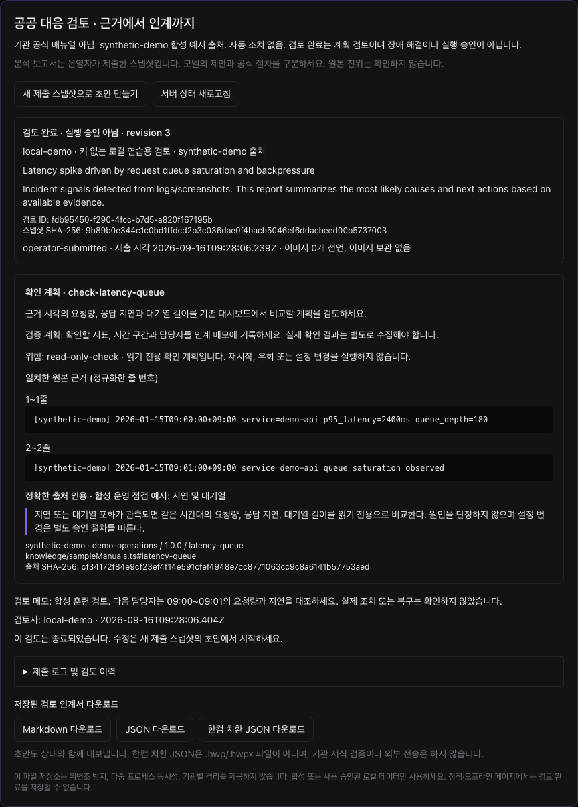

# 로컬 검증 기록 — 2026-09-16

이 문서는 합성 데이터로 실행한 로컬 프로토타입의 검증 결과입니다. 검증한 구현 커밋은 `cdc04460e98e0e5d797cb83ed812cd59da404611`입니다. [기계 판독 요약](evidence/local-verification.json)도 제공합니다. 운영망, 실제 기관 자료, 외부 LLM의 품질, 공공 인증이나 실제 복구 시간 개선을 검증한 문서가 아닙니다.

## 환경과 최종 결과

- macOS, Node.js v22.23.2, npm 10.9.8, Vitest 4.1.11.
- 기본 제공자는 `LLM_PROVIDER=demo`. 외부 제공자·클라우드 자격 증명은 비웠습니다.
- 최종 `verify`와 브라우저용 로컬 서버는 macOS `sandbox-exec`로 loopback 외의 outbound 연결을 차단했습니다.
- 실제 Chrome에서는 페이지의 외부 호스트 요청을 별도로 차단했습니다. Google 로그인은 합성 SDK 이벤트 테스트만 수행했습니다.

| 검증 | 결과 |
| --- | --- |
| 일반 `npm ci` | 통과 |
| `npm run verify` | 종료 코드 0 |
| TypeScript | 통과 |
| Vitest | **43개 파일, 435개 테스트 통과. 건너뛴 테스트 없음** |
| 기존 사건 재현 평가 | 합성 사례 4개, **32/32 체크 통과** |
| 아키텍처 점검 | 실제 loopback HTTP로 통과 |
| 프로덕션 빌드 | 통과. 아래 번들 크기 경고는 남음 |
| `npm audit` | **보고된 취약점 0개** |
| 별도 실제 API 검증 | 아래 경계·상태·내보내기 흐름 통과 |
| 실제 Chrome — 키 없는 데모 | 전체 흐름 통과, 페이지 오류 0, 페이지 외부 요청 0 |
| 실제 Chrome — 공유 토큰 인증 | 전체 흐름 통과, 페이지 오류 0, 페이지 외부 요청 0 |

최초 기준선은 33개 파일·188개 테스트와 동일한 재현 평가 32개 체크였습니다. 테스트 수 증가나 합성 통과율을 제품의 실제 정확도·안전성·현장 효과 지표로 해석하지 않습니다. npm audit 결과도 애플리케이션 취약점이 없다는 보증이 아닙니다.

## 확인한 실제 흐름

### 브라우저

1. 한국어 소개와 접힌 선택 기능 화면을 로드합니다.
2. 합성 JSONL 4건을 실제 파일 입력으로 가져옵니다. 잘못된 JSON 파일은 거부하며 기존 입력이 보존됩니다.
3. 합성 지연 사례를 분석하고 서버에 대응 검토 초안을 만듭니다.
4. 원본 로그 줄과 매뉴얼의 정확한 인용·버전·해시를 확인합니다.
5. 점검 계획별 확인과 메모가 없으면 완료 버튼이 활성화되지 않습니다.
6. 계획 검토를 완료하고 Markdown, JSON, 한컴 치환 JSON을 실제로 다운로드합니다.
7. 새로고침 후 입력 첫 화면의 최근 검토로 같은 기록을 서버에서 다시 엽니다.
8. 최근 검토 재개 또는 서버 상태 새로고침에 실패하면 이전 검토 완료 표시를 신뢰할 수 있는 최신 상태처럼 남기지 않습니다.

인증을 켠 두 번째 실행에서는 익명 조회·내보내기 거부, 실제 로그인과 HttpOnly 쿠키, 공유 토큰의 검토자 표기, 다른 출처의 저장 거부, 쿠키 제거 후 새로고침 실패 처리를 확인했습니다. 입력 토큰이 localStorage·sessionStorage에 남지 않는지도 확인했습니다.

[키 없는 브라우저 결과](evidence/browser-workflow-results.json) · [인증 브라우저 결과](evidence/browser-auth-results.json)

### API와 저장

- 원격으로 받은 actor·검토 상태 같은 위조 필드를 거부합니다.
- 동시 시작 명령 중 하나만 저장하며 나머지는 409로 거부합니다.
- 오래된 revision, 잘못된 상태 전이와 확인 항목 누락을 거부합니다.
- 일치하지 않는 로그와 보관되지 않은 이미지의 근거 공백이 있으면 완료하지 않습니다.
- 출처 스냅샷을 손상시키면 조회·내보내기·검토가 모두 실패합니다.
- Content-Length 없는 chunked 요청도 첫 JSON 파서에서 크기를 제한합니다.
- 서버 저장값의 한글 상태·메모·심각도를 내보내며, 예제 템플릿의 11개 치환 문자열과 정확히 일치합니다.

[별도 실제 API 결과](evidence/parent-api-results.json)

## 리뷰에서 찾고 수정한 문제

| 문제 | 재현과 수정 확인 |
| --- | --- |
| 인증된 배포에서도 일부 세션·내보내기를 익명으로 읽을 수 있었음 | 익명 200을 재현한 뒤 403과 내용 비노출을 확인 |
| 공개 메타데이터에 제공자 자격 증명·URL이 노출될 수 있었음 | 합성 비밀값을 넣은 실패 테스트 후 안전한 상태 정보만 반환 |
| 실패한 재현 평가 CLI가 종료 코드 0을 반환 | 진단 JSON은 보존하고 종료 코드 1로 변경 |
| 외부 CDN·Google SDK를 기본 화면에서 즉시 로드 | 로컬 CSS 빌드와 명시적 연결 시 SDK 로드로 변경 |
| SDK 로드 실패를 데모 로그인 성공으로 처리 | 설정된 Google 연결은 실패로 표시하며 데모로 전환하지 않음 |
| 검토 저장 후에야 긴 OIDC subject·시계 역행을 발견 | 저장 전에 전체 기록을 검증하고 실패 시 기존 파일을 보존 |
| 작은 라우터 제한보다 큰 전역 JSON 파서가 먼저 실행 | 실제 full-app chunked 요청 201을 재현한 뒤 413으로 변경 |
| 다른 사건의 최근 검토를 현재 보고서 안에서 열 수 있었음 | 보고서 문맥 안의 임의 재개를 막고 첫 화면에서만 최근 검토 허용 |
| 입력 가져오기·기록 삭제 뒤 이전 보고서와 새 근거가 섞일 수 있었음 | 분석을 무효화하고 저장된 입력 스냅샷만 검토에 사용 |
| 분석에서 제외한 초과 이미지까지 저장된 개수에 포함 | 17개 선택·16개 분석 경계를 재현하고 실제 분석 대상 개수를 저장. 이미지 근거 공백 차단은 유지 |
| Vite 프록시가 Host를 바꿔 정상 브라우저 저장도 거부 | 실제 Vite 경유 403을 재현한 뒤 Host를 보존. 정상 201·다른 출처 403을 모두 검사 |
| 분석이 허용한 긴 로그를 검토의 별도 한도와 구분하지 못함 | 제출 전에 공유 스키마로 검사. 50,001자·1,001줄은 전송하지 않고 재분석을 안내하며, 경계값은 원문 그대로 제출 |
| 기존 메타데이터 테스트가 공유 이벤트 파일의 다른 요청에 영향받음 | 실제 실패를 기록한 뒤 해당 테스트의 저장 파일만 임시 경로로 격리. 기존 검증 조건은 유지 |

기능 구현과 분리한 별도 AI 검토 세션으로 코드 리뷰와 문서·연계 계약 리뷰를 수행했습니다. 리뷰는 이 변경 범위의 결함 탐지이며 외부 보안 인증이나 침투시험이 아닙니다.

## 재현

```bash
npm ci
LLM_PROVIDER=demo npm run verify
npm audit
LLM_PROVIDER=demo npm run dev
```

macOS에서 사용한 선택적 네트워크 제한은 다음과 같습니다. 다른 운영체제에서는 같은 효과의 방화벽·격리 환경을 별도로 구성해야 합니다.

```bash
/usr/bin/sandbox-exec -p '(version 1) (allow default) (deny network-outbound) (allow network-outbound (remote ip "localhost:*"))' npm run verify
```

그 뒤 [사용 안내](RESPONSE_WORKFLOW.ko.md)의 화면 순서를 따릅니다. 새로고침으로 분석 화면이 복원되면 Start New로 입력 화면에 돌아가 최근 검토를 여세요. 이전 사건의 완료 상태를 다른 보고서에 붙이지 않기 위한 제한입니다.

## 남은 한계

- 프로덕션 빌드의 단일 JavaScript 번들은 약 500 kB여서 Vite 크기 경고가 남습니다. 경고 기준을 올려 숨기지 않았습니다. 후속 코드 분할 대상입니다.
- 기존 제공자의 분석 본문·원본 로그는 그대로 보존합니다. 한글 항목·검토 계획·메모를 제공하지만 영문 분석 내용을 자동 번역하지는 않습니다.
- 실제 OIDC 발급자, Google OAuth 로그인, 외부 LLM·클라우드·SIEM, Windows Hancom 출력은 실행하지 않았습니다.
- 파일 저장소의 기관별 격리, 암호화, 위변조 방지, 다중 서버 동시성, 보존·삭제 정책은 미구현입니다.
- GitHub 원격 게시나 배포를 실행한 검증이 아닙니다. 이 기록은 로컬 작업본을 대상으로 합니다.

## 실제 화면



세부 실행 로그와 실패 전후 자료는 작업 산출물 디렉터리에 보관했습니다. 이 저장소에는 재현 명령, 자동 회귀 테스트, 요약 JSON과 실제 화면을 포함합니다.
